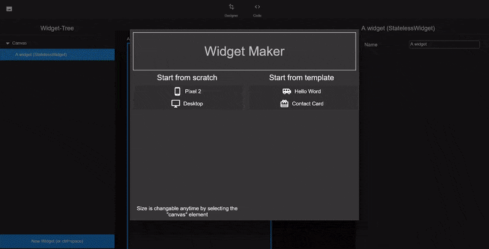
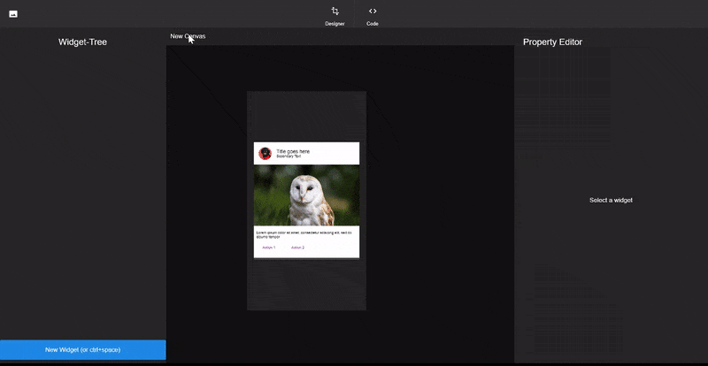
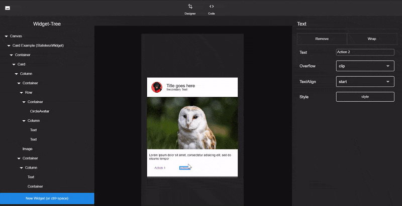

# The Widget-Maker

<a href="https://www.buymeacoffee.com/norbertkozsir" target="_blank"></a>



## State of the project

The project is currently not maintained by me and the code could probably use a bit
of refactoring.

This README is still work in progress.

If anybody is interested in contributing/ forking/ using it as a base for another project - feel free!


## Features

- Templates
- Different Canvas sizes
- Build and "Play" (interact with UI) mode
- Multiple Canvases and instantiation
- Code Generation




## Building 

This is intended to be run using Flutter Desktop or Flutter web. 
For Desktop, simply switch to the master channel and run:
```
flutter run -d [windows|linux|macos]
```

## The concept

A few words about the code architecture.


### Widget-Elements

Widget-Elements play a central part in the Widget-Maker as these are actual widgets
you drag around and style. 
The Widget-Elements can be found under [`lib/data/widget_elements`](lib/data/widget_elements).

Widget-Elements form a forth tree (on top of Widgets/RenderObjects and Elements) they include
a lot of meta information.
Widget-Elements only manage the tree, but not the actual rendering, interaction and modification
of the widgets, that is up to the widget which is generated by the `generateWidget()` method.
Those widgets have to mix in `ElementWidgetStateMixin`, that class contains code which handles common UX scenarios
like accepting children via drag, or showing a border on selection.


#### Making new Widget-Elements

You certainly can make new Widget-Elements by hand, in fact Widget-Elements such as the `Scaffold`,
`Row` and more are hand made.

But a lot of widgets are pretty basic, so instead of copy-pasting the same wrapper code over and over again,
there is a generator which does that for you.

Take a look at (lib/Data/widget_elements/config.yaml and README.md) to get a sense of the schema.

To generated those widget simply execute the [`lib/data/widget_elements/scripts/build.dart`](lib/data/widget_elements/scripts/build.dart) file.
Be sure to be inside the script folder when running that script because it relies on relative paths!

```
dart build.dart
```


### Properties

The [`MProperty`](lib/data/properties/basic_properties.dart) is the base class for all properties inside the Widget-Maker.
Each Widget-Element has a list of properties. These properties reflect the constructor parameters
of the widgets in code.
Properties are responsible for providing a way of changing themselves and providing meta information.

For more information take a look at [lib/data/properties/basic_properties.dart](lib/data/properties/basic_properties.dart) 


## Running the test

Not all tests seem to pass as of now.

```
flutter test
```


## Website

The docs folder contains the source for www.widgetmaker.dev

## Donations

Feel free to donate a pizza/ coffee :)
